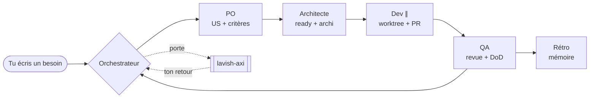

<div align="center">

# 🧩 Agile Agents

**Une équipe agile d'agents IA pour Claude Code.**
La définition de l'agile — sans la lourdeur humaine.


</div>

---

Tu écris un besoin en langage naturel. L'orchestrateur **pilote tout seul** :
il raffine, planifie, code, teste et revoit — et ne te sollicite qu'aux **portes
de validation**, via [lavish-axi](https://github.com/kunchenguid/lavish-axi).
Aucune commande à retenir.



## Deux plans de communication

| Plan | Comment | Contenu |
| --- | --- | --- |
| **IA ↔ IA** | contrats JSON sur le board | terse, structuré, tracé — aucune prose |
| **Humain ↔ IA** | aux portes agiles, via lavish | tu écris, tu annotes — jamais de commande |

## Démarrer — 3 étapes

```bash
# 1. Copier ce dossier à la racine de ton projet, puis :

# 2. Installer la porte de validation humaine
npx skills add kunchenguid/lavish-axi --skill lavish

# 3. Adapter le SEUL point spécifique au projet (tests + lint)
$EDITOR scripts/dod.sh
```

Puis tu discutes, simplement :

```bash
claude --agent orchestrateur
> Je veux une page de connexion, verrouillage après 3 échecs.
```

L'orchestrateur découpe en US, code, teste, et t'ouvre une revue quand il a
besoin de toi. Le board se voit d'un coup d'œil : `lavish-axi board/board.html`.

## Structure

```
.claude/agents/       orchestrateur · po · architecte · dev · qa · retro
.claude/settings.json WIP + hook de porte DoD
board/                backlog.json (US) + board.json (wip + events) = source de vérité
board/board.html      vue kanban lisible par l'humain
board/schema/         contrats JSON : us, enveloppe, rapport, event
architecture/         architecture.json (vérité) + architecture.html (vue + Mermaid)
scripts/board.mjs     API partagée : lire/écrire le board, tracé
scripts/dod.sh        ← le seul fichier à adapter à ta pile
docs/                 communications.md · conventions.md
```

## Conventions Git

Branche longue `main`, travail sur `feature/<US-ID>-<slug>`, commits
[Conventional Commits](https://www.conventionalcommits.org) référençant l'US,
PR titrée `<US-ID> <titre>` vers `main`. Détail dans `docs/conventions.md`.

## Hiérarchie : simple par choix

**US** = l'unité de travail qu'un agent réalise. `epic` = regroupement optionnel.
Pas de Feature, pas de points, pas de sous-tâches : c'est la lourdeur humaine
qu'on évite, pas l'agile.

## Philosophie

On garde ce qui crée de la valeur — séparation intention/exécution, backlog
priorisé, portes de qualité, flux à WIP limité, boucle d'apprentissage — et on
jette les rituels qui n'existent que pour synchroniser des humains. Le résultat :
la même discipline, pilotée par l'IA, en langage naturel.

<div align="center"><sub>MIT · agnostique · pensé pour Claude Code</sub></div>
